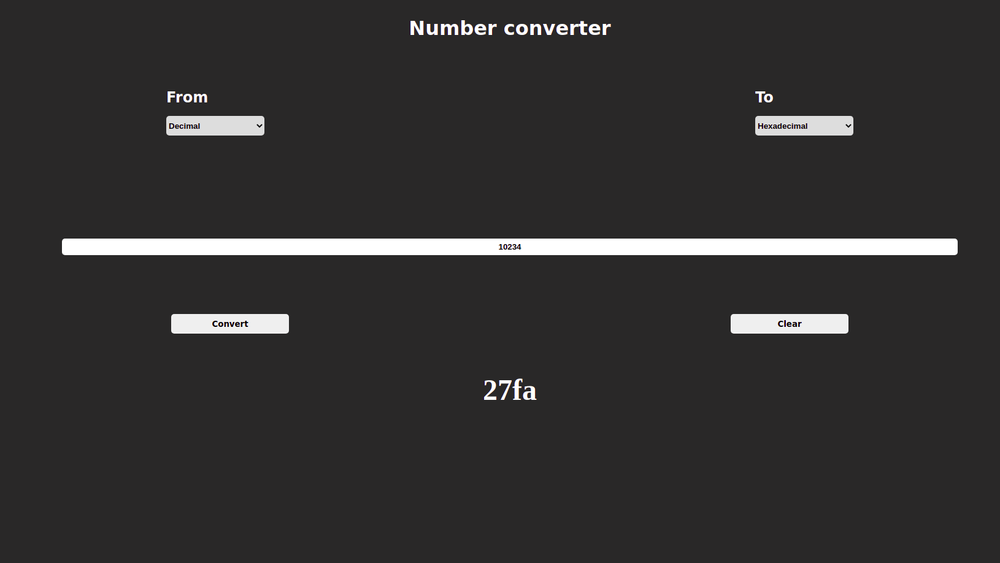

# Number converter App

## Table of Contents

### About The Project

Built a number converter application from decimal to binary and hexadecimal.
This application was made to improve and practice on HTML, SCSS and npm server.
The app is full responsive.

- Built With
  - HTML;
  - SCSS;
  - JavaScript;
  - gh-pages;
  - npm live-server.

### Getting Started

- Prerequisites
  - vsCode;
  - node modules;
  - package JSON.
- Installation
  - development tools:
    - node modules;
    - package.json;
    - package-lock.json;
    - gh-pages;
    - sass;
    - live-server.

### Usage

- HTML;
- SCSS;
- JavaScript;
- Google fonts.

### Contributing

## Iulian Stan

### License

- Copyright protected

### Contact

[**Iulian Stan**](https://github.com/iulianSta)

### Acknowledgement

### I want to thank to the [**DCI**](https://www.digitalcareerinstitute.org) team and teachers!
